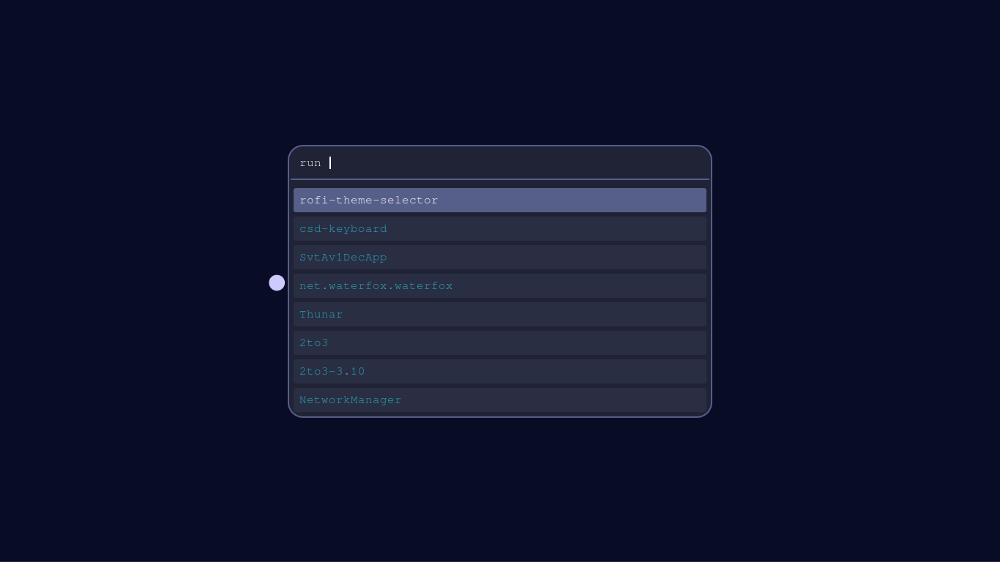
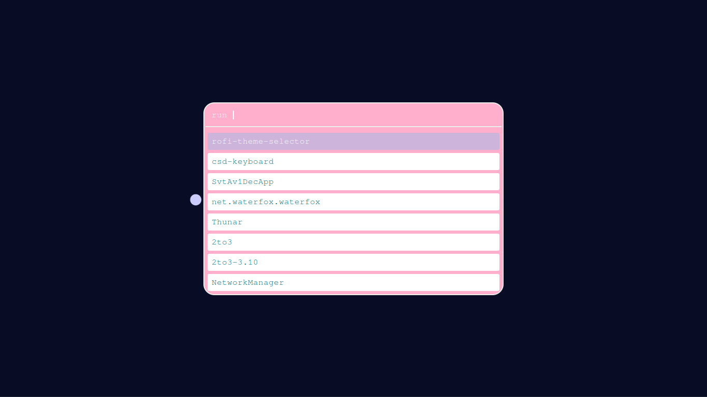

<!DOCTYPE html>
<html>
  <head>
  </head>
  <body>
    <h1>Rofi Themes</h1>
    
This repository contains themes for the Rofi application launcher. Currently, there are two themes available: Blue and Pink. More themes may be added in the future.

<h2>Themes</h2>

<h3>Blue Theme</h3>

<h3>Pink Theme</h3>

<h2>Installation</h2>

<ol>
  <li>Clone the repository:</li>

  <pre><code>git clone https://github.com/praveen3164/Rofi-Color_Theme.git</code></pre>
  
  <li>If you don't have the directories needed for the install create them with</li>

  <pre><code>mkdir -p ~/.local/share/rofi/themes/</code></pre>

  <li>Copy the theme file you want to use (e.g. <code>blue.rasi</code> or <code>pink.rasi</code>) to the Rofi themes directory:</li>

  <pre><code>cp blue.rasi ~/.local/share/rofi/themes/</code></pre>

  <li>Open Rofi and select the theme from the list of available themes:</li>

  <pre><code>rofi -show run -theme ~/.local/share/rofi/themes/blue.rasi</code></pre>
</ol>

Alternatively, you can copy the theme file to the system-wide Rofi themes directory, which is typically located at <code>/usr/share/rofi/themes/</code>. This will make the theme available to all users on the system.

<h2>Contributing</h2>

If you would like to contribute a new theme to this repository, please follow these guidelines:

<ul>
  <li>Themes should be stored in the <code>themes/</code> directory and have a <code>.rasi</code> extension.</li>
  <li>The name of the theme file should reflect the name of the theme (e.g. <code>green.rasi</code> for a green-themed theme).</li>
  <li>The theme file should be self-contained and not rely on any external assets or files.</li>
  <li>The theme file should be well-documented and include any necessary comments or explanations.</li>
</ul>

<h2>License</h2>

These themes are released under the <a href="LICENSE">MIT License</a>.

  </body>
</html>
